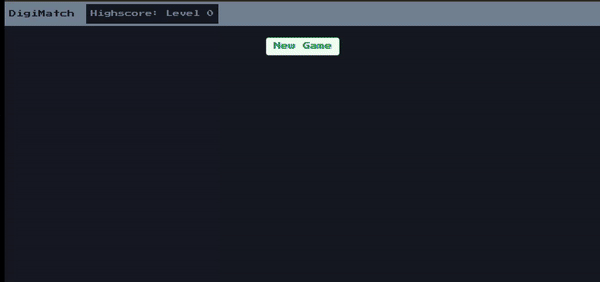

# DigiMatch

### [Live Demo](https://digimatch.vercel.app/)



#### 💡 Features
* Implemented card shuffling logic using Fisher-Yates algorithm:

```
  for (let i = array.length - 1; i > 0; i--) {
    const j = Math.floor(Math.random() * (i + 1));
    const temp = array[i];
    array[i] = array[j];
    array[j] = temp;
  }
```
* User highscore is saved in local storage, allowing users to keep track of their best scores and compete against themselves over time.
* Responsive on mobile


#### 🛠️ Built with 
 * Next.js
 * Chakra UI

This is a [Next.js](https://nextjs.org/) project bootstrapped with [`create-next-app`](https://github.com/vercel/next.js/tree/canary/packages/create-next-app).

## Getting Started

First, run the development server:

```bash
npm run dev
# or
yarn dev
# or
pnpm dev
```

Open [http://localhost:3000](http://localhost:3000) with your browser to see the result.
